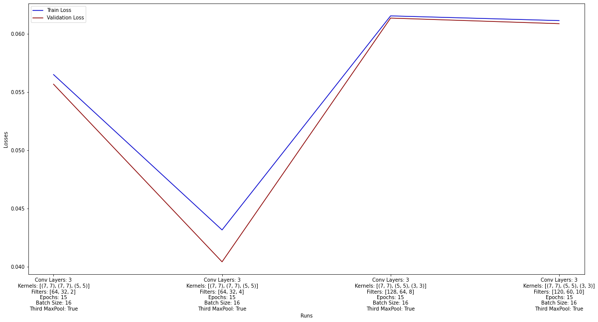

# Analysis
In the current file the results of all algorithms regarding the 4 parts of this project will be analyzed with multiple experiments at a time.

## Part 1
The first parameter that can be tailored is the architecture of the encoder. The [autoencoder](Autoencoder/src/autoencoder/autoencoder.py) file and its [notebook](Autoencoder/notebook/Autoencoder.ipynb) counterpart support many different configuration options like number of convolutional layers, kernel sizes etc. In order to achieve a small dimension for the latent vector, the filter sizes have to be small and the usage of a third max-pooling layer is necessary. The following graph shows the MSE loss among 4 different experiments with latent vector dimensions of 2, 4, 8 and 10 respectively.

The 2nd experiment (with latent dimension of 4) seems the most promising one so this is the one we will be using to generate the new space for **Part 2**.
